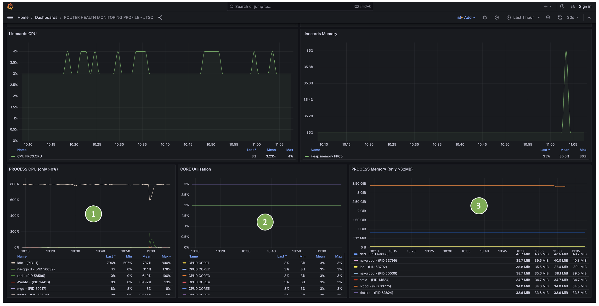
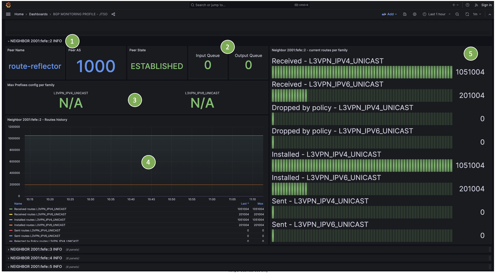
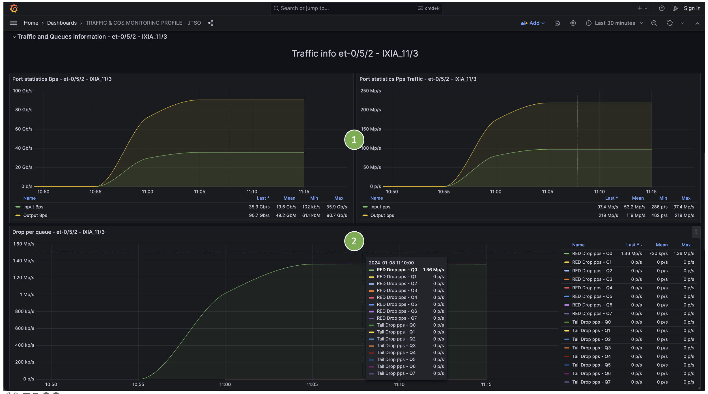
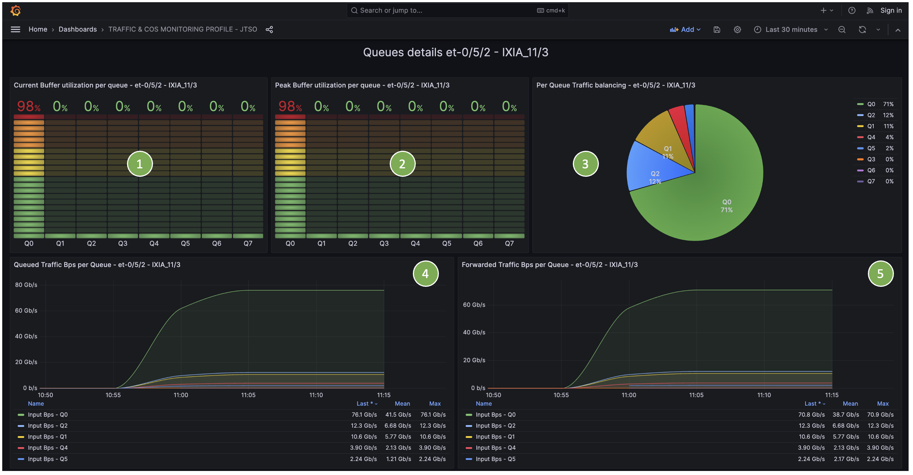
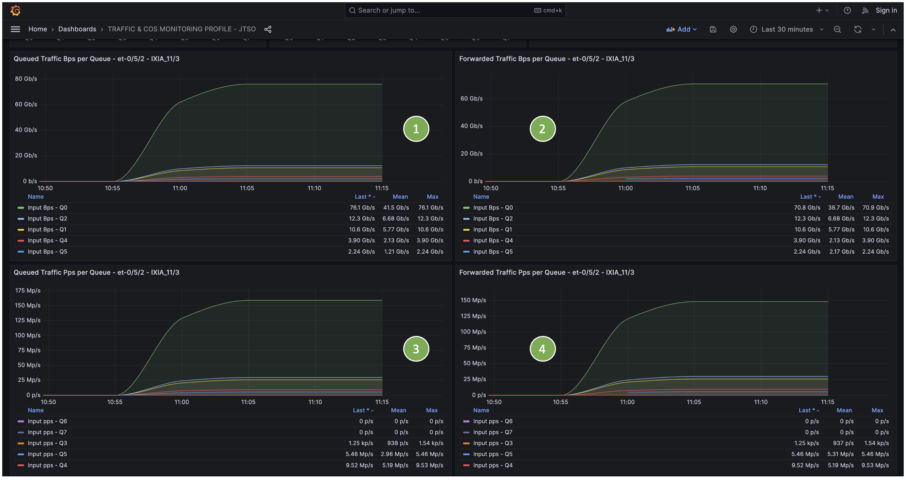
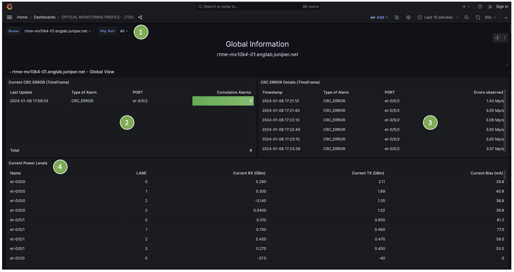
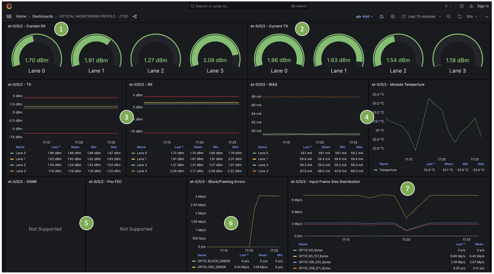
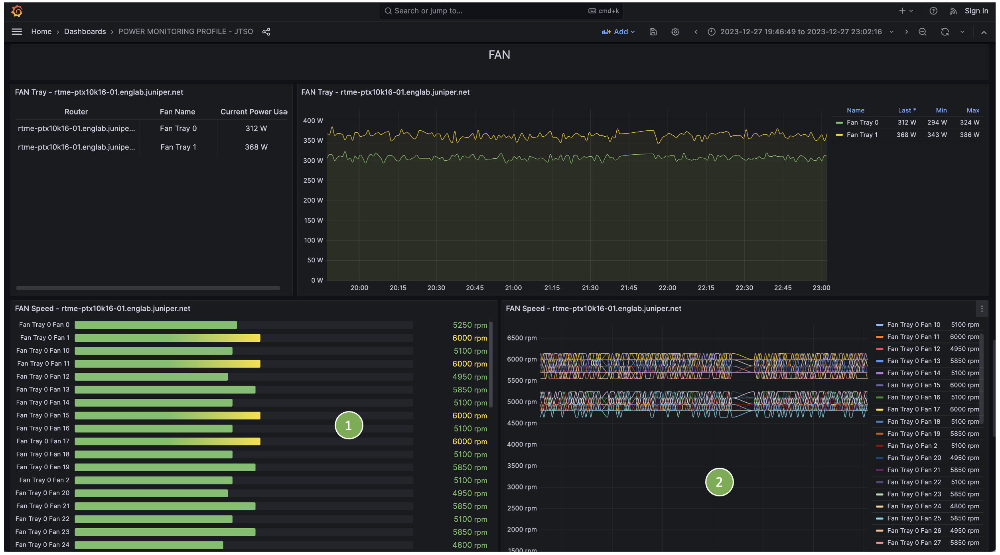

# Profiles informations

Each profile is a set of files packed together in a tgz archive. Those tgz files are stored in compose/jtso/profile directory. This folder is monitored, if you push a new version of a profile, this will trigger an automatic update of the stack. 

## Router Health profile

Router health KPIs: CPU, Memory, Errors, Drops...

### Sensor path details

### Dashboard screenshots

    (1) Select Route
    (2) Current Real Time Error – monitored by the ALARMING Telegraf plugin
    (3) Current chassis alarms – i.e. show chassis alarms
    (4) Current RE Master/Backup CPU & Memory usage
    (5) List of all MPC/FPC current CPU & Memory usage 
    (6) On-Change based Syslog 

    (1) Details of the current chassis alarms
    (2) All past/active MPC/FPC CMERROR 
    (3) All current router alarms – monitored by the ALARMING Telegraf plugin
    (4) Details of all current router alarms – monitored by the ALARMING Telegraf plugin

    (1) History of CPU/Memory usage of Nominal/Backup RE
    (2) History of CPU/Memory usage of all MPC/FPC

    (1) History of CPU consumption of all RE Master Processes
    (2) History of CPU usage of each RE Master cores
    (3) History of Memory consumption of all RE Master Processes

    (1) History of per FPC/MPC Fabric drops
    (2) History of per FPC/MPC input Fabric rate (pps)
    (3) History of per FPC/MPC output Fabric rate (pps)

## BGP profile

BGP KPIs: peer-groups, families and peers statistics. 

### Sensor path details

### Dashboard screenshots

    (1) Filter per Router, per Routing-Instance, per Peer-Group, per Family and Per Neighbor 
    (2) Per Peer-Group (Instance / Name) number of active paths 
    (3) Per Peer-Group Received/Installed/Sent prefixes
    (4) Per family number of active paths
    (5) On-Change BGP events  

    (1) Per neighbor detailed info
    (2) For each neighbor: peer name, peer AS, Current session state, Input&Output queues 
    (3) Per family prefix-limit if configured
    (4) History over the time of routes received, installed, rejected by policy, sent 
    (5) Per Family route details

## Traffic/CoS profile

Traffic KPIs: peer queue statistics, per port statistics, queue-depth, drop per queue/port...

### Sensor path details

### Dashboard screenshots

    (1) Filter per router, physical interfaces
    (2) Current real-time traffic alarms (RED, TAIL, CRC) drops - monitored by the ALARMING Telegraf plugin
    (3) Overall traffic distribution – per Queue
    (4) Details of each real-time traffic alarms (point 2) 

    (1) For each port port statistics – In/Out in bps and pps 
    (2) For each port – per queue drops (red & tail) over the time 

    (1) Real time per Queue Depth utilization – current usage 
    (2) Real time per Queue Depth utilization – peak usage 
    (3) Traffic distribution per queue for the given port 
    (4) Queued traffic per queue  – in Bps 
    (5) Real Forwarded traffic per queue  – in Bps 

    (1) Queued traffic per queue – in Bps 
    (2) Real Forwarded traffic per queue - in Bps
    (3) Queued traffic per queue – in pps 
    (4) Real Forwarded traffic per queue - in pps

## Optic profile

Optic KPIs: Optic levels, Physical errors, per optic details...

### Sensor path details

### Dashboard screenshots

    (1) Filter per router and per physical port 
    (2) Real-time CRC/BLOCK error alarms – monitored by the ALARMING Telegraf plugin
    (3) Details of each CRC/BLOCK error alarms over the time
    (4) Per port – per lane Current TX, RX, BIAS values

    (1) Per port Optic Alarms

    (1) For each physical port/optic – per Lane current RX
    (2) For each physical port/optic – per Lane current TX
    (3) History over the time of each lane RX/TX + low/high warning threshold
    (4) History over the time of optic BIAS and temperature 
    (5) For OTN Optic (i.e. 400G ZR optic) – history over time of the OSNR and pre-FEC correction 
    (6) History over the time of the CRC and BLOCK errors 
    (7) Input frame size distributions over the time 

## Power profile

Power KPIs: per component power usage, global usage, temperature, fan state...

### Sensor path details

### Dashboard screenshots

    (1) Chassis information 
    (2) Configured Ambient Temperature 
    (3) Overall chassis power information 
    (4) In case of multi-zone Chassis – overall zone power information 

    (1) History over the time of the overall chassis power consumption 
    (2) Per components power consumption – over time 

    (1) Per component temperature over the time 

    (1) Per MPC/FPC current power consumption 
    (2) History over the time of each MPC/FPC power consumption 
    (3) Per FAN current power consumption 
    (4) History over the time of each FAN power consumption 

    (1) Per FAN current FAN Speed 
    (2) History over the time of each FAN speed

    (1) Per CB/Fabric/RE current power consumption 
    (2) History over the time of each CB/Fabric/RE power consumption 
    (3) Per PEM/PSM current power consumption 
    (4) History over the time of each PEM/PSM power consumption 

    (1) Total of power consumption 
    (2) Per Model power consumption 
    (3) History over the time of the total power consumption 
    (4) History over the time for each chassis model of the total power consumption 

## Firewall profile

FWF KPIs: per firewall term counters, per policer drop counter...

### Sensor path details

### Dashboard screenshots

