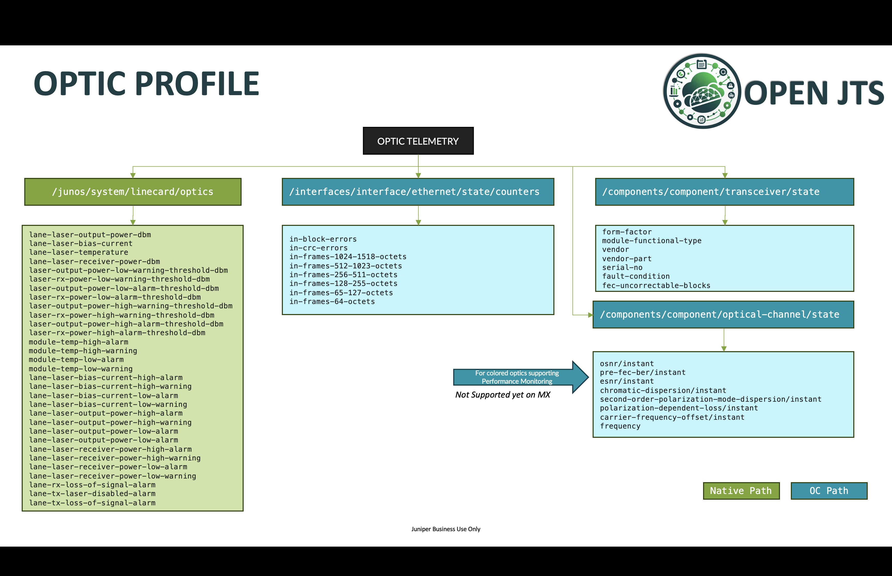

# Profiles informations
 
 **Table of content:**
 - [Home](README.md)
 - [Installation](INSTALL.md)
 - [Configuration](CONFIG.md)
 - [Update Stack](UPDATE.md)
 - [Utilization](USAGE.md)
 - [Profiles documentation](PROFILES.md)

Each profile is a set of files packed together in a tgz archive. Those tgz files are stored in compose/jtso/profile directory. This folder is monitored, if you push a new version of a profile, this will trigger an automatic update of the stack. 

## Router Health profile

Router health KPIs: CPU, Memory, Errors, Drops...

### Sensor path details

### Dashboard screenshots

#### Router health details

    (1) Select Route
    (2) Current Real Time Error – monitored by the ALARMING Telegraf plugin
    (3) Current chassis alarms – i.e. show chassis alarms
    (4) Current RE Master/Backup CPU & Memory usage
    (5) List of all MPC/FPC current CPU & Memory usage 
    (6) On-Change based Syslog 

    (1) Details of the current chassis alarms
    (2) All past/active MPC/FPC CMERROR 
    (3) All current router alarms – monitored by the ALARMING Telegraf plugin
    (4) Details of all current router alarms – monitored by the ALARMING Telegraf plugin

    (1) History of CPU/Memory usage of Nominal/Backup RE
    (2) History of CPU/Memory usage of all MPC/FPC

    (1) History of CPU consumption of all RE Master Processes
    (2) History of CPU usage of each RE Master cores
    (3) History of Memory consumption of all RE Master Processes

    (1) History of per FPC/MPC Fabric drops
    (2) History of per FPC/MPC input Fabric rate (pps)
    (3) History of per FPC/MPC output Fabric rate (pps)

#### NPU Statistics

    (1) Select HW component – depends on the type of Linecard
    (2) Select the HW property(ies)

    (1) Provide Router information
    (2) Recall current chassis alarms
    (3) Display the HW KPI over the time 
    (4) Display the current HW KPI value

## BGP profile

BGP KPIs: peer-groups, families and peers statistics. 

### Sensor path details

### Dashboard screenshots

    (1) Filter per Router, per Routing-Instance, per Peer-Group, per Family and Per Neighbor 
    (2) Per Peer-Group (Instance / Name) number of active paths 
    (3) Per Peer-Group Received/Installed/Sent prefixes
    (4) Per family number of active paths
    (5) On-Change BGP events  

    (1) Per neighbor detailed info
    (2) For each neighbor: peer name, peer AS, Current session state, Input&Output queues 
    (3) Per family prefix-limit if configured
    (4) History over the time of routes received, installed, rejected by policy, sent 
    (5) Per Family route details

## Traffic/CoS profile

Traffic KPIs: peer queue statistics, per port statistics, queue-depth, drop per queue/port...

### Sensor path details

### Dashboard screenshots

#### Physical Interfaces Traffic

    (1) Filter per router, physical interfaces
    (2) Current real-time traffic alarms (RED, TAIL, CRC) drops - monitored by the ALARMING Telegraf plugin
    (3) Overall traffic distribution – per Queue
    (4) Details of each real-time traffic alarms (point 2) 

    (1) For each port port statistics – In/Out in bps and pps 
    (2) For each port – per queue drops (red & tail) over the time 

    (1) Real time per Queue Depth utilization – current usage 
    (2) Real time per Queue Depth utilization – peak usage 
    (3) Traffic distribution per queue for the given port 
    (4) Queued traffic per queue  – in Bps 
    (5) Real Forwarded traffic per queue  – in Bps 

    (1) Queued traffic per queue – in Bps 
    (2) Real Forwarded traffic per queue - in Bps
    (3) Queued traffic per queue – in pps 
    (4) Real Forwarded traffic per queue - in pps

#### Logical Interfaces Traffic

    (1) Select physical port and unit(s)
    (2) Port statistics
    (3) Input traffic load sharing per unit
    (4) Ouput traffic load sharing per unit

    (1) Per unit traffic in Bps and PPS

#### VoQ System (PTX Only)

Need specific configuration on the device to enable the feature.

    (1) Filter per router, physical interfaces
    (2) Current real-time traffic alarms (RED, TAIL, CRC) drops - monitored by the ALARMING Telegraf plugin
    (3) Overall traffic distribution – per Queue
    (4) Details of each real-time traffic alarms (point 2) 
    (5) For each port port statistics – In/Out in bps and pps & traffic types
    (6) Traffic distribution – per queue – for a specific port

    (1) Forwarded traffic per egress queue in Bps and PPS
    (2) Egress Queue drops

    (1) Real time per VoQ Depth information – Current / Average and Peak
    (2) History graphs for VoQ Depth

## Optic profile

Optic KPIs: Optic levels, Physical errors, per optic details...

### Sensor path details

### Dashboard screenshots

    (1) Filter per router and per physical port 
    (2) Real-time CRC/BLOCK error alarms – monitored by the ALARMING Telegraf plugin
    (3) Details of each CRC/BLOCK error alarms over the time
    (4) Per port – per lane Current TX, RX, BIAS values

    (1) Per port Optic Alarms

    (1) Inventory information
    (2) For each physical port/optic – per Lane current RX
    (3) For each physical port/optic – per Lane current TX
    (4) History over the time of each lane RX/TX + low/high warning threshold
    (5) History over the time of optic BIAS and temperature 
    (6) History over the time of the CRC and BLOCK errors 
    (7) Input frame size distributions over the time 

    (1) OTN Specific information
    (2) Frequency and Carrier Frequency Offset
    (3) History over the time of OSNR and ESNR 
    (4) History over the time of pre-fec engine
    (5) History over the time of Chromatic Dispersion
    (6) History over the time of SOPDM
    (7) History over the time of PDL

## Power 

Power KPIs: per component power usage, global usage, temperature, fan state...
Provide also the overall input traffic view and the ratio Watts per Gbps. 

### Sensor path details

### Dashboard screenshots

#### Per router Power consumption 

    (1) Chassis information 
    (2) Configured Ambient Temperature 
    (3) Overall chassis power information 
    (4) In case of multi-zone Chassis – overall zone power information 

    (1) Total chassis input traffic in Bps
    (2) Total chassis input traffic in Pps
    (3) Ratio Watts per Gbps. 

    (1) History over the time of the overall chassis power consumption 
    (2) Per components power consumption – over time 

    (1) Per component temperature over the time 

    (1) Per MPC/FPC current power consumption 
    (2) History over the time of each MPC/FPC power consumption 
    (3) Per FAN current power consumption 
    (4) History over the time of each FAN power consumption 

    (1) Per FAN current FAN Speed 
    (2) History over the time of each FAN speed

    (1) Per CB/Fabric/RE current power consumption 
    (2) History over the time of each CB/Fabric/RE power consumption 
    (3) Per PEM/PSM current power consumption 
    (4) History over the time of each PEM/PSM power consumption 

#### Power aggregation Dashboard

    (1) Total of power consumption 
    (2) Per Model power consumption 
    (3) History over the time of the total power consumption 
    (4) History over the time for each chassis model of the total power consumption 

## Firewall profile

FWF KPIs: per firewall term counters, per policer drop counter...

### Sensor path details

### Dashboard screenshots

    (1) Select per router, per filter, per counter & policer history
    (2) PPS view – Counters are displayed as positive Y and Policer out-of-spec counters as Negative Y
    (3) BPS view – Counters are displayed as positive Y and Policer out-of-spec counters as Negative Y

## DDOS profile

DDOS protection KPIs: Support per MPC DDOS protection statistics
Currently, only supported for MX & PTX

### Sensor path details

### Dashboard screenshots

    (1) Filter per router, per protocol and sub protocol 
    (2) Global Dashbord - Display for the last 15 minutes the router(s) under DDOS Policer Violation 
    (3) Per Protocol Details for the selected router
    (4) Current (aggregated) protocol stats (Received, Dropped & Punted to RE)
    (5) History of received pps, per Linecard, for a given protocol and one or several sub-protocol.
    (6) History of dropped pps, per Linecard, for a given protocol and one or several sub-protocol.
    (7) History of punted pps, per Linecard, to the RE for a given protocol and one or several sub-protocol.

## SR MPLS profile

SR MPLS KPIs: SR MPLS Traffic per interfaces, per SID, ingress egress - need specific configuration on the device to enable the feature

### Sensor path details

### Dashboard screenshots

#### Per Interface SR MPLS Stats

    (1) Filter per router, physical interfaces
    (2) SR MPLS in/out Bps/Pps per interface 
    (3) The percentage of SR MPLS traffic relative to other traffic (on this interface)

#### Per LABEL (SID) SR MPLS Stats

    (1) Filter per router, MPLS LABEL (derived from SID)
    (2) Traffic load per SID (LABEL)
    (3) Traffic in PPS and BPS per SID (LABEL)
