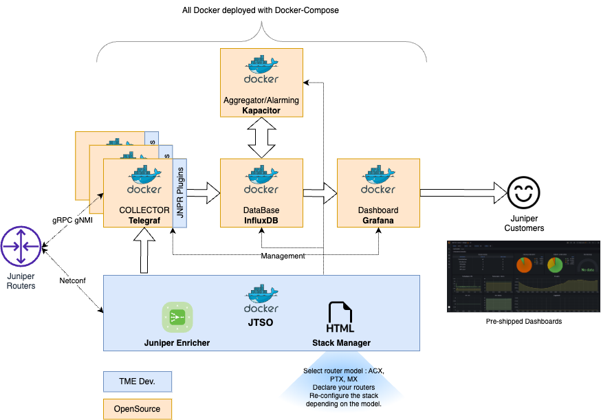

# Juniper Telemetry Stack - aka. JTS

## Disclaimer

This project is a "side time project". I'm not a software developper, so be indulgent with me :). 

## Quick Overview

Embark on a journey to discover and embrace Juniper Telemetry solution with this simple project. Designed for effortless adoption, this all-in-one tool is here to demystify gRPC Telemetry on Juniper routing products. We currently support PTX 10K, MX (vMX, Neo and 10K platforms) & ACX 7K platforms. Junos/EVO 20.1 and onwards are supported.

Feel free to open issue if you experience some troubles for a given HW or SW version. The profiles have been tested with recent Junos releases so some older versions may use different "counters" naming - especially when OpenConfig models are used. I can easily patch a profile, in minutes, without touching the code. Moreover, if you want I develop a new profile for a new use case, don't hesitate to also open an issue. 

This project is made around 3 main repos:

- OpenJTS: https://github.com/door7302/openjts - provides the infra for deplying the stack and includes all theh profiles
- JTSO: https://github.com/door7302/jtso - the source code of the jtso component 
- JTS Telegraf: https://github.com/door7302/jts_telegraf - a fork of the telegraf project which includes several plugins and enhancements for OpenJTS. 

All comments, remarks, ideas are welcome. you can reach out to me here: **door7302@gmail.com**

## Getting Start

 **Table of content:**
 - [Home](README.md)
 - [Installation](INSTALL.md)
 - [Configuration](CONFIG.md)
 - [Update Stack](UPDATE.md)
 - [Utilization](USAGE.md)
 - [Profiles documentation](PROFILES.md)
 
## Presentation 

This is a repo to build from scratch a Telemetry stack to monitor any Juniper Routing Devices. 

This stack has the codename "JTS" which stands for Juniper Telemetry Stack 

This stack relies on OpenSource software solutions such as **Telegraf** for collecting gNMI Telemetry state data (it also supports Netconf input plugin for data not yet available through Telemetry) and pre-processing the data, **InfluxDB** as a Time Series Database to store data, **Kapacitor** to aggregate and perform Alarming and finally **Grafana** to display contents. A specific piece of software developed by Juniper and called **JTSO**, which stands for JTS Orchestrator, is also present in the stack (Dev. in **GOLANG**). This piece of software developed by TME AWAN Team has 2 main roles: the first one is to manage the Stack (provision routers IP, select the pre shipped profils) and on the other hands provide an Enricher tool to enrich on-the-fly telemetry data for better visualization and aggregation).  

JTS is pre-filled with templates of configuration and dashbords for typical use cases. Those profiles are tgz files store in **compose/jso/profiles directory** 

JTS relies on Docker Compose to deploy in one command this stack. Please be sure you have done all the prerequisites before.

JTS has only been validated for Ubuntu/Debian Host OS. 

{- Notice: Currently JTS uses a specific build of Telegraf which offers more functionalities (dev. by Juniper). Juniper will continue to push these enhancements to the official Telegraf project -}

