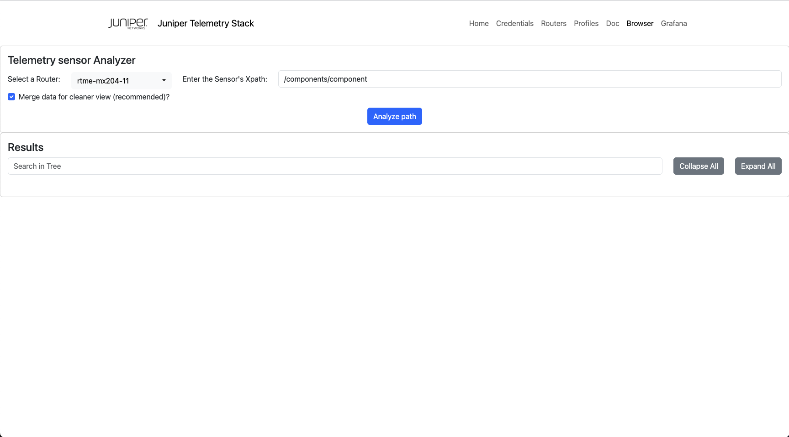
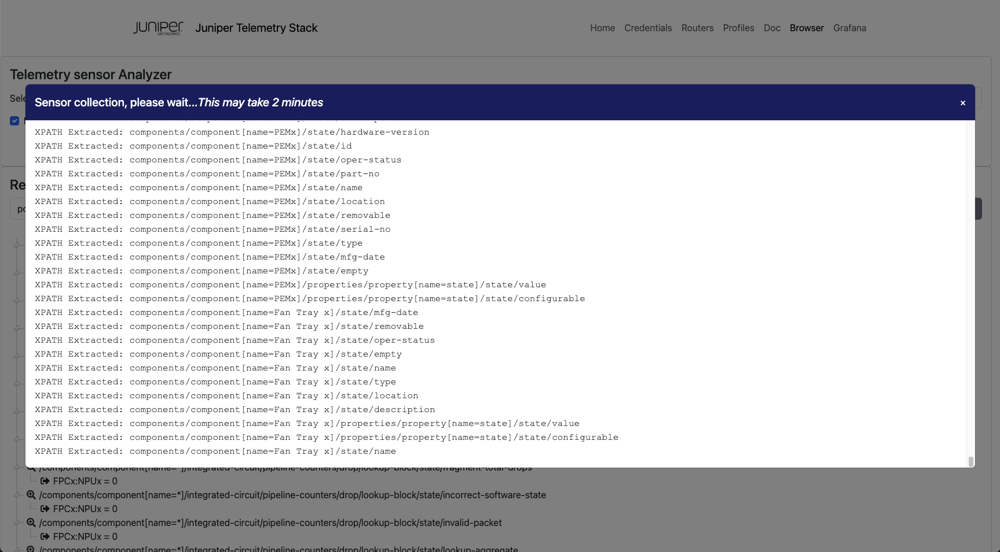
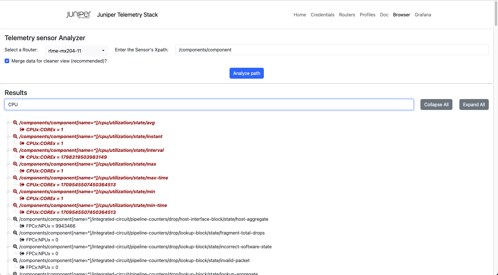

# Start OpenJTS 

 **Table of content:**
 - [Home](README.md)
 - [Installation](INSTALL.md)
 - [Configuration](CONFIG.md)
 - [Update Stack](UPDATE.md)
 - [Utilization](USAGE.md)
 - [Profiles documentation](PROFILES.md)

## Start the stack 

To start the JTS you just need to deploy each docker by using **docker compose up** command. 

You can start the OpenJTS with the following command:

{- The first time you bring up the stack, it may take slightly more time as we need to build on-the-fly Telegraf -} 

```shell 
# Bring up the stack with one Telegraf Instance
sudo docker compose up -d  
```

You may want to check if dockers are up and running. For that, just issue the following command:

```shell
sudo docker compose ps
```

Note: Telegraf docker(s) are only started if there is at least one router assigned to the Telegraf instance. 

## JTS logs 

JTS writes its logs into **/var/log/jtso.log**

## Stop JTS

To stop the JTS just issue the following command:

```shell
# Shutdown the stack
sudo docker compose down
```

## Manage the stack via JTSO

Once launched you should have access to the JTSO portal (http or https). Open a web browser and open the portal: **http(s)://your-ip:your-port/index.html**
You should have access to this page - this one provide the state of the OpenJTS. You can also empty the InfluxDB database by clicking on the "EmptyDB" button. 


## Configure credentials

Go to the menu **"Credentials"**

First step is to fill the Netconf/gNMI user/pwd you configured on your routing devices. Remember, the credentials are the same for all routers. 
You can also indicate to the stack that you want to use TLS/SSL for gNMI. Once again this is for all routing devices. It means either you'll use TLS for all routers or you'll use clear text mode for all devices. By default TLS is disabled, skip-verify is enabled and client-side TLS authentication is disabled. 


## Configure your inventory

Go to the menu **"Routers"**

Here you must fill for each router:
- a unique short name (internal use only)
- the IP or hostname of the remote device 

Automatically, the JTSO will open a Netconf session to the device to retrieve some facts like the chassis model & version. 


## Navigate in the profiles DOC

Go to the menu **"DOC"**

Here you will find some information regarding the profiles:
- Which sensors/counters used to build the profile 
- Some detail about the config files (telegraf, kapacitor) 
- The Dashboards shipped with the profile 


## Assign router to profile(s)

Go to the menu **"Profiles"**

Here you can assign/remove one or several profiles to a given router. Each time you add/remove a router in this page, the stack will be re-configured automatically.


## Browse a sensor path

Go to the menu **"Browser"**

Here you need to select a router and to fill a well-known sensor path. The "Merge" option allows better analysis by replacing numeric key by a "X". 



The analysis takes about 1 minute. You should see the list of XPATH extracted from the sensor in real time:



Then, the result is displayed as a tree view. You can expand or collapse the tree via the respective buttons. You can also search in tree - search results are highlighted in red.  



## Use Grafana Dashboard(s)

Go to the menu **"Grafana"**

By clicking on the Grafana menu you will have directly access to the Grafana portal. 


Enjoy.... 