# Start OpenJTS 

 **Table of content:**
 - [Home](README.md)
 - [Installation](INSTALL.md)
 - [Configuration](CONFIG.md)
 - [Update Stack](UPDATE.md)
 - [Utilization](USAGE.md)
 - [Profiles documentation](PROFILES.md)

## Start the stack 

To start the JTS you just need to deploy each docker by using **docker compose up** command. 

You can start the OpenJTS with the following command:

{- The first time you bring up the stack, it may take slightly more time as we need to build on-the-fly Telegraf -} 

```shell 
# Bring up the stack with one Telegraf Instance
sudo docker compose up -d  
```

You may want to check if dockers are up and running. For that, just issue the following command:

```shell
sudo docker compose ps
```

Note: Telegraf docker(s) are only started if there is at least one router assigned to the Telegraf instance. 

## JTS logs 

JTS writes its logs into **/var/log/jtso.log**

## Stop JTS

To stop the JTS just issue the following command:

```shell
# Shutdown the stack
sudo docker compose down
```

## Manage the stack via JTSO

Once launched you should have access to the JTSO portal (http or https). Open a web browser and open the portal: **http(s)://your-ip:your-port/index.html**
You should have access to this page - this one provide the state of the OpenJTS stack. You can also empty the InfluxDB database by clicking on the "EmptyDB" button. You may also access directly to Chronograf (for managing InfluxDB or Kapacitor) by clicking on the related button. 

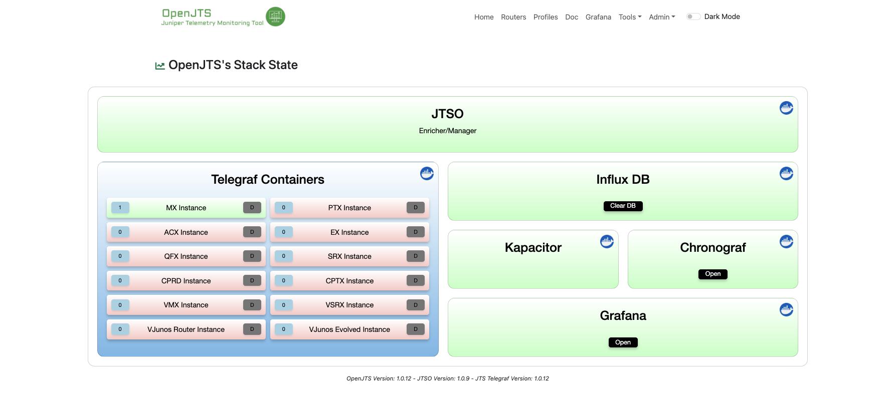

On top right of the page, you can switch to the dark theme, if prefered. 

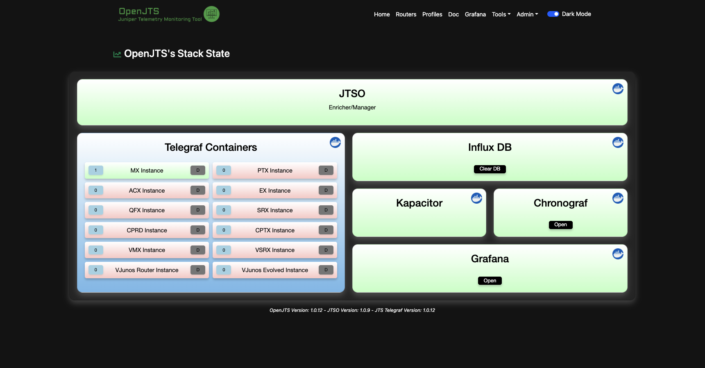

Each Telegraf container displays 2 indicators: 

- The left number supplies the number of routers collected by the container 
- The right "D" button is a button which allows you to enable Telegraf Debugging. By clicking on this button the related container is automatically restarted in debug mode. Debug is enabled when the "D" button is in Red. Make sure to use Debug only for troubleshooting purposes as it requires a lot of disk space (huge file(s) may be generated):

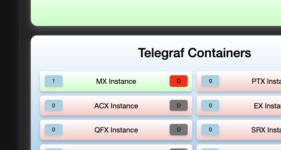

## Configure credentials

Go to the menu **"Admin > Credentials"**

First step is to fill the Netconf/gNMI user/pwd you configured on your routing devices. Remember, the credentials are the same for all routers. 
You can also indicate to the stack that you want to use TLS/SSL for gNMI. Once again this is for all routing devices. It means either you'll use TLS for all routers or you'll use clear text mode for all devices. By default TLS is disabled, skip-verify is enabled and client-side TLS authentication is disabled. 

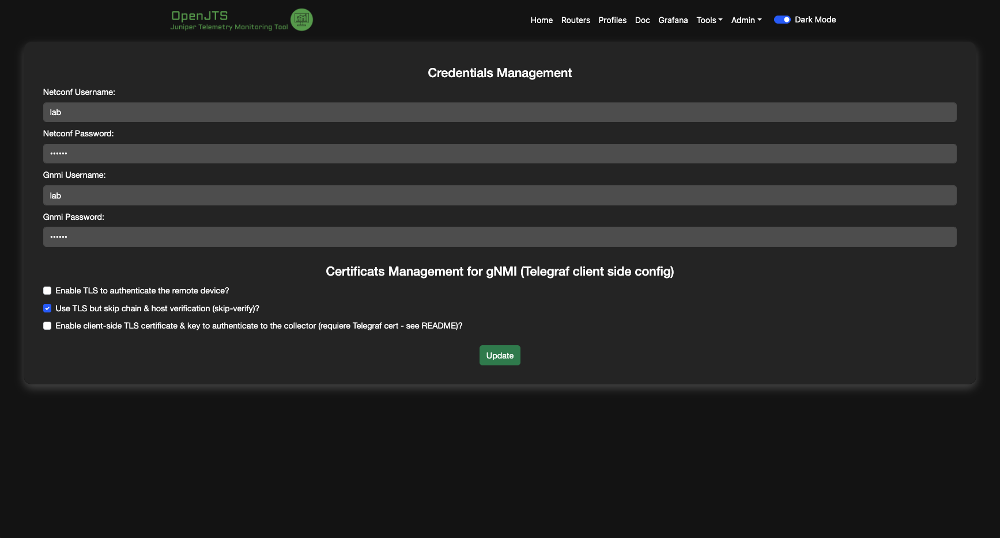

## Configure your inventory

Go to the menu **"Routers"**

Here you must fill for each router:
- a unique short name (internal use only)
- the IP or hostname of the remote device 

Automatically, the JTSO will open a Netconf session to the device to retrieve some facts like the chassis model & version. 

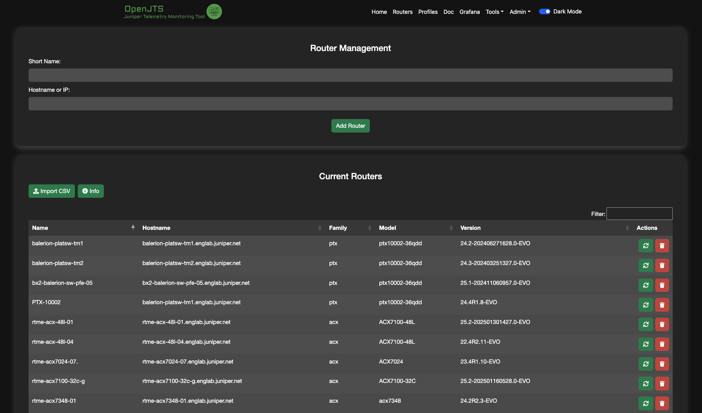

There are a few actions available: 

- You can import your inventory thanks to a CSV file. Each line of this file must contain: [shortName];[HostName]
- You may for the refresh of a given router by clicking on the refresh button (see Actions column)
- you can remove a given router by clicking on the remove button (see Actions column)

A router could not be removed if it is associated to a profile.

## Navigate in the profiles DOC

Go to the menu **"DOC"**

Here you will find some information regarding the profiles:
- Which sensors/counters used to build the profile 
- Some detail about the config files (telegraf, kapacitor) 
- The Dashboards shipped with the profile 

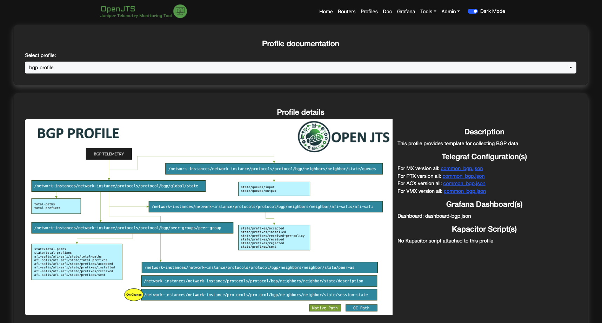

You can click on the "collector" config to have more information about the Telegraf configuration. This file is a json's JTSO file that will be rendered as Telegraf's TOML config file further. 

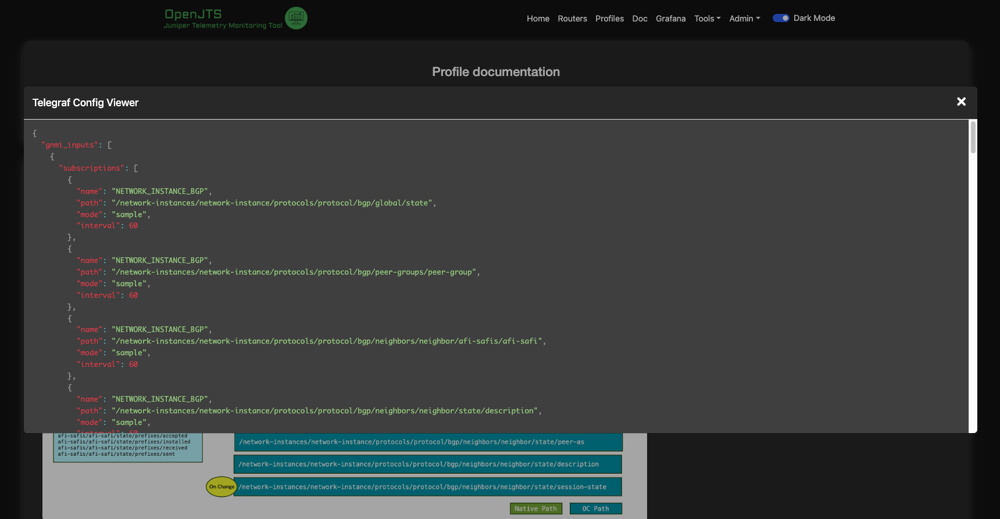

## Assign router to profile(s)

Go to the menu **"Profiles"**

Here you can assign/remove one or several profiles to a given router. Each time you add/remove a router in this page, the stack will be re-configured automatically.

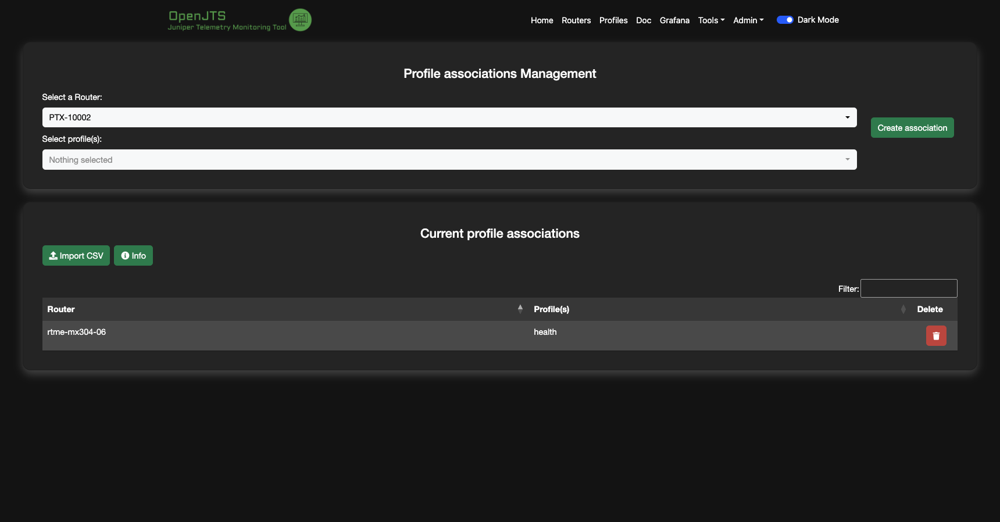

You may also choose to configure router/profiles associations by importing a CSV file. The format of each line of this line must be: [shortName];[profileName1];[profileName2];...

## Browse a sensor path

Go to the menu **"Tools > Gnmi Browser"**

Here you need to select a router and to fill a well-known sensor path. The "Merge" option allows better analysis by replacing numeric key by a "X". For full Xpath view you need to unselect the "Merge" option 

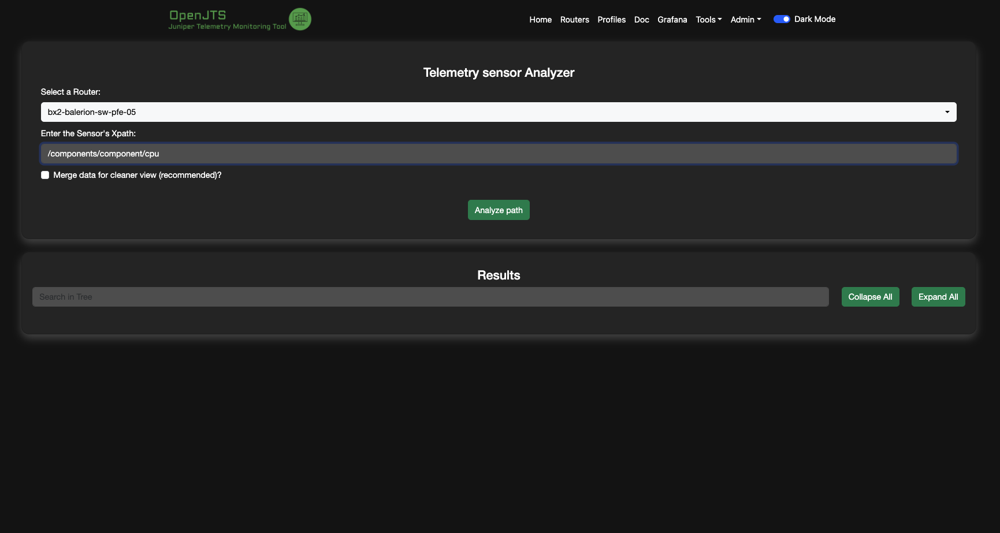

The analysis takes about a minute. You should see the number of XPATHs extracted from the sensor in real time:

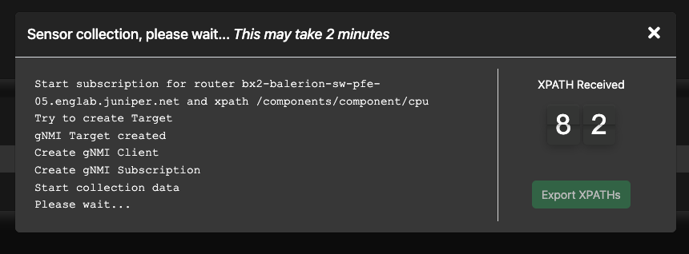

You can export the full Xpaths list if needed by clicking on the "Export Xpaths" button - a new tab will open automatically:

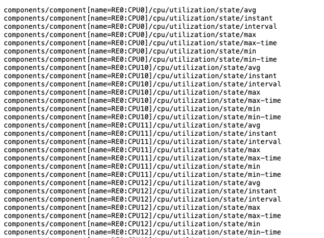

Then, the result is displayed as a tree view. You can expand or collapse the tree via the respective buttons. You can also search in tree - search results are highlighted in red.  

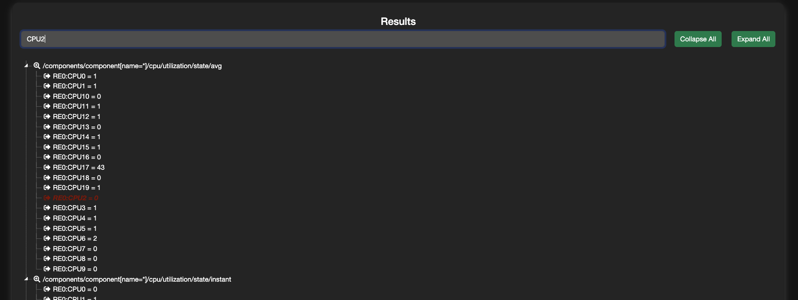

## Check Stack performances 

Go to the menu **"Admin > Stack Util. & Logs"**

Here is where you can monitor CPU and Memory consumption of each running container:

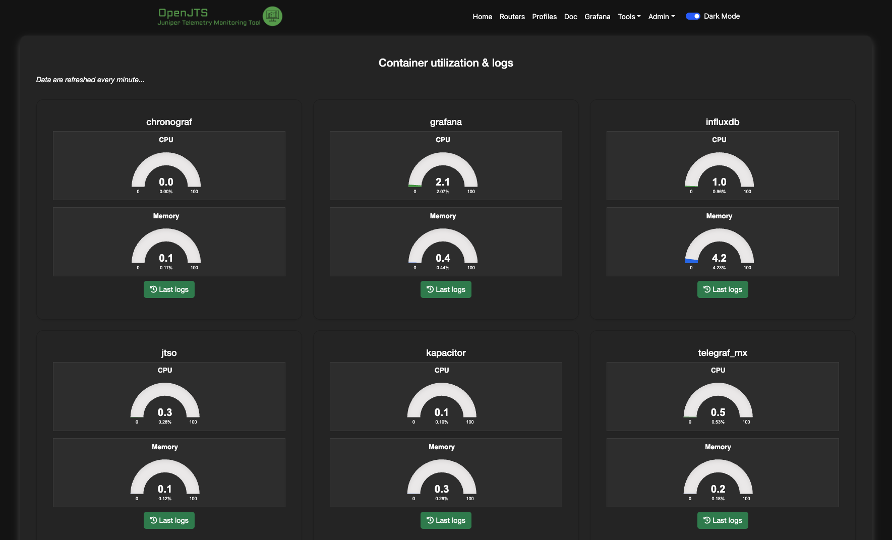

You may also display the latest container's logs by clicking on the associated button:

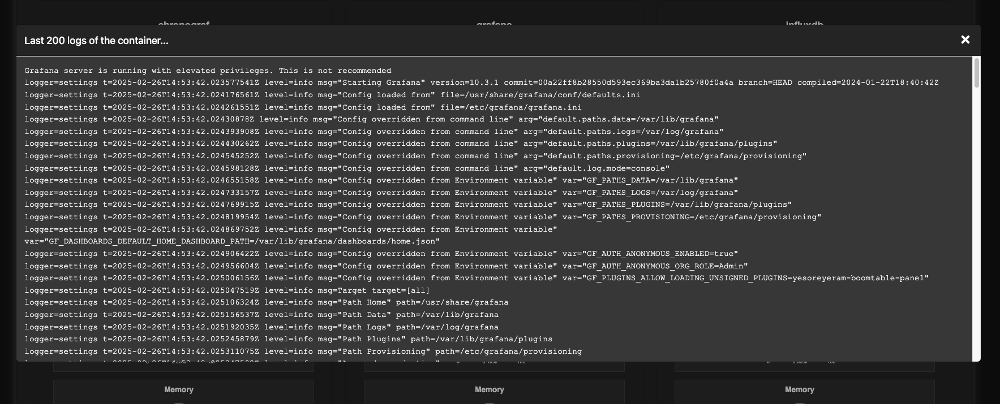

## Manage Influxdb 

Go to the menu **"Admin > Manage InfluxDB"**

By clicking on this menu, you will have access to the Chronograf page for managing InfluxDB "measurements":

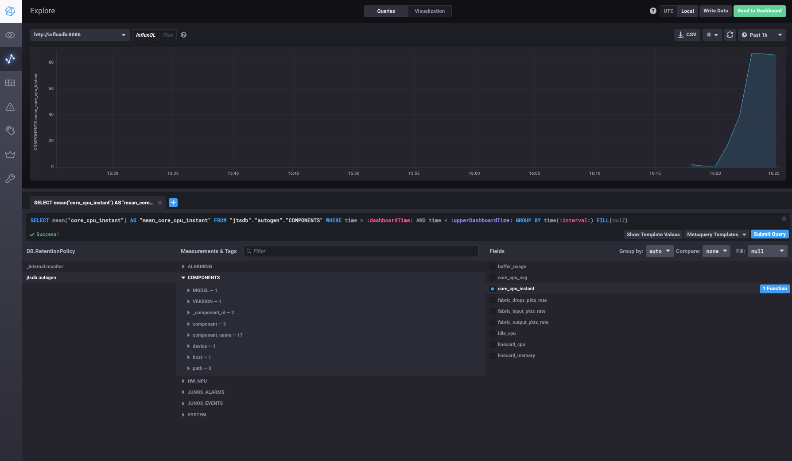

## Manage Kapacitor 

Go to the menu **"Admin > Manage Tick Scripts"**

By clicking on this menu, you will have access to the Chronograf page for managing Kapacitor Tick Scripts:

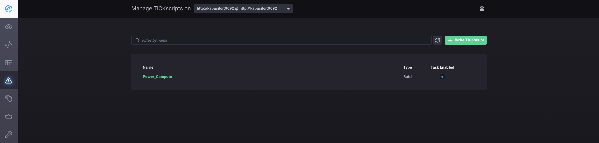

You may want to view or edit a given script:

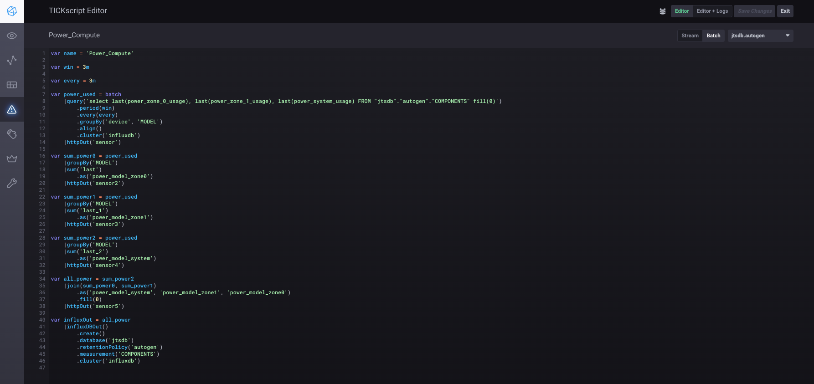

## Use Grafana Dashboard(s)

Go to the menu **"Grafana"**

By clicking on the Grafana menu you will have directly access to the Grafana portal. 

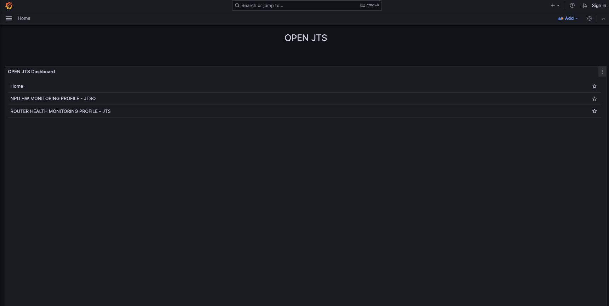

Enjoy.... 