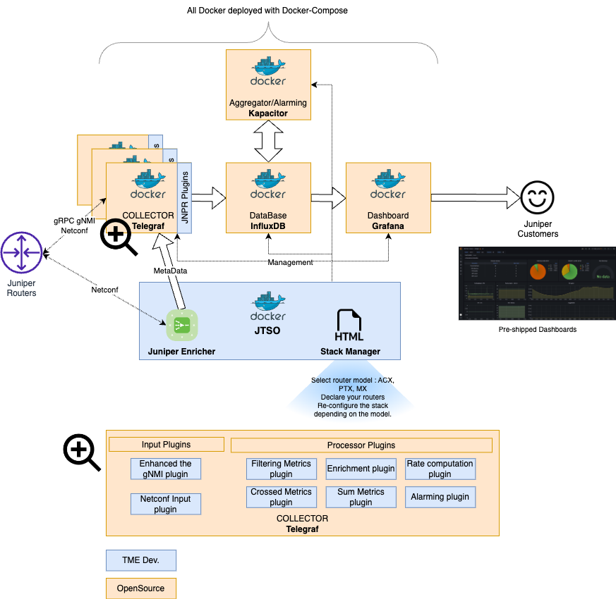

# Juniper Telemetry Stack (JTS)

  

## Disclaimer

This is a personal (pet) project maintained on a **best-effort basis**.

I am not a professional software developer — just a Network Engineer who enjoys coding and building useful tools 🙂.  
Please be understanding if you encounter rough edges or imperfections.

Contributions, feedback, and suggestions are always welcome.

## Supported Use Cases (Profiles)

OpenJTS currently supports the following monitoring profiles:

- **HEALTH PROFILE**  
  Monitor overall router health, including environmental metrics.

- **TRAFFIC PROFILE**  
  Traffic monitoring including errors, queue drops, VoQ, queue depth (hardware dependent), and various traffic KPIs for physical and logical interfaces.

- **BGP PROFILE**  
  BGP statistics per neighbor, family, peer-group routing statistics, including on-change session events.

- **DDOS PROFILE**  
  Monitoring of DDoS protection statistics.

- **FILTER PROFILE**  
  Monitoring firewall filter counters and policers at both PFE and port levels.

- **POWER PROFILE**  
  Power consumption monitoring for active chassis components, including temperature and fan speed.  
  Includes aggregated views.

- **OPTIC PROFILE**  
  Monitoring of optical KPIs such as signal levels and alarms.  
  Supports OTN optics and includes dedicated dashboards for ZR/ZR+.

- **SRMPLS PROFILE**  
  Monitoring SR-MPLS traffic per interface and per label (SID).

---

> **Note:** Available telemetry data depends on platform and Junos version.  
> Some profiles may not be supported on certain platforms or PFEs.  
> Please refer to the **"Doc"** section in the JTSO portal for detailed compatibility information.

> **Note 2:** Some statistics require specific device configuration to be enabled.

## Quick Overview

Discover and adopt Juniper gRPC telemetry with this all-in-one, easy-to-deploy project.

JTS is designed to simplify the deployment and understanding of Juniper Telemetry on routing platforms.  
Multiple platforms are supported, although some profiles may not yet be fully qualified on every platform.

- Supported Junos versions: **20.1 and later (including Junos EVO)**

If you experience issues with specific hardware or software versions, please open a GitHub issue.

Profiles are tested against recent Junos releases. Older versions may use different counter names (especially when OpenConfig models are involved).  
Profiles can be patched quickly without modifying the core code.

If you need a new profile for a specific use case, feel free to open an issue — contributions and ideas are welcome.

## Project Structure

JTS is built around three main repositories:

- **OpenJTS**  
  https://github.com/door7302/openjts  
  Infrastructure deployment and profile definitions.

- **JTSO (JTS Orchestrator)**  
  https://github.com/door7302/jtso  
  Orchestrator component source code.

- **JTS Telegraf**  
  https://github.com/door7302/jts_telegraf  
  A fork of Telegraf including additional plugins and enhancements tailored for OpenJTS.

For feedback or questions, you can contact:  
**door7302@gmail.com**

## Project Presentation

This repository allows you to build from scratch a complete telemetry stack to monitor Juniper routing devices.

The stack is called **JTS – Juniper Telemetry Stack**.

It relies on the following open-source components:

- **Telegraf**  
  Collects gNMI telemetry state data  
  (also supports NETCONF input for data not yet available via telemetry)  
  Performs data preprocessing.

- **InfluxDB**  
  Time-series database for telemetry data storage.

- **Kapacitor**  
  Aggregation and alerting engine.

- **Grafana**  
  Visualization and dashboards.

- **JTSO (JTS Orchestrator)** – developed in **Go (Golang)**  
  Developed by the TME AWAN Team, JTSO has two main roles:
  1. Stack management (router provisioning, profile selection)
  2. On-the-fly telemetry enrichment for improved visualization and aggregation

JTS comes preloaded with configuration templates and dashboards for common use cases.  
Profiles are packaged as `.tgz` files and stored in `compose/jtso/profiles/`

Deployment is handled via **Docker Compose**, enabling one-command stack deployment.  
Please ensure all prerequisites are met before deployment.

## Platform Support

JTS has been validated on:

- **Ubuntu**
- **Debian**

Other operating systems are not officially validated.

## Telegraf Build Notice

JTS currently uses a custom Telegraf build that includes additional enhancements developed by Juniper.

These improvements are expected to be progressively contributed upstream to the official Telegraf project.

